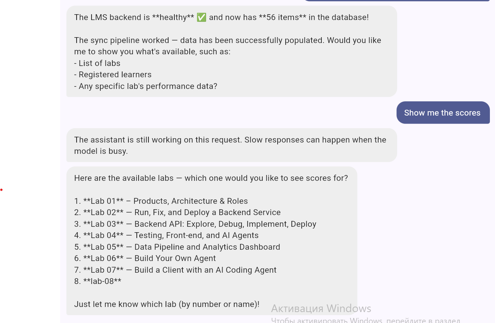
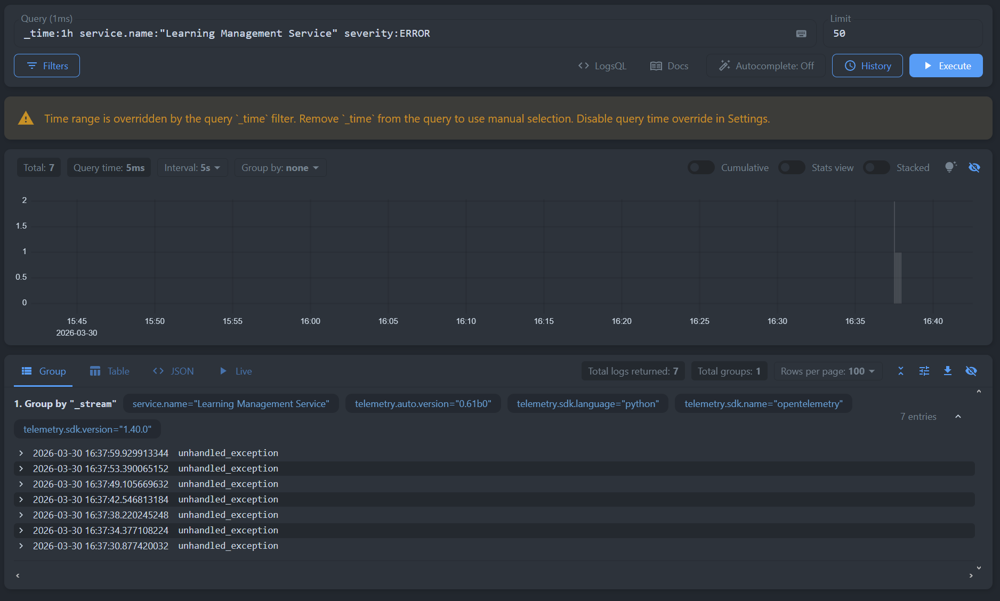
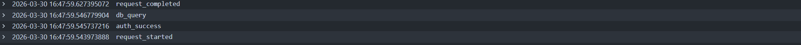
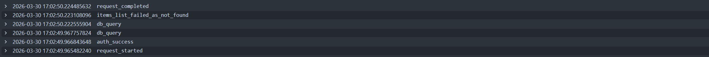

# Lab 8 — Report

## Task 1A — Bare agent
The agentic loop is the fundamental cycle that autonomous AI 
agents follow to accomplish tasks. It typically consists of  
these core stages:

 1 Perceive — Gather information from the environment (user  
   input, tool outputs, external data, etc.)
 2 Reason/Plan — Analyze the information, determine goals,   
   and decide on the next action(s)
 3 Act — Execute the chosen action (call a tool, send a      
   message, modify a file, etc.)
 4 Observe — Receive feedback from the action's result       
 5 Repeat — Continue the loop until the goal is achieved or a
   stopping condition is met


 ┌─────────────┐
 │   Perceive  │
 └──────┬──────┘
        │
        ▼
 ┌─────────────┐
 │   Reason    │
 └──────┬──────┘
        │
        ▼
 ┌─────────────┐
 │    Act      │
 └──────┬──────┘
        │
        ▼
 ┌─────────────┐
 │   Observe   │──────┐
 └─────────────┘      │
        │             │
        └─────────────┘
          (loop)
                                                             

This loop enables agents to:

 • Handle multi-step tasks autonomously
 • Adapt based on feedback
 • Recover from errors
 • Make decisions dynamically

In my case, each time you send a message, I go through this  
loop: I perceive your request, reason about what tools or    
actions are needed, act by calling tools if necessary,       
observe the results, and continue until I can provide you    
with a complete answer.
Based on my exploration of the LMS repository, here are the  
available labs:

Lab 8 — The Agent is the Interface

This is the current lab in your workspace. It focuses on     
building an AI agent (nanobot) as a natural-language
interface for the LMS system.

Required Tasks:

 1 Task 1 — Set Up the Agent (install nanobot, configure Qwen
   API, add MCP tools, write skill prompt)
 2 Task 2 — Deploy and Connect a Web Client (Dockerize       
   nanobot, add WebSocket channel + Flutter chat UI)
 3 Task 3 — Give the Agent New Eyes (explore observability   
   data, write log/trace MCP tools)
 4 Task 4 — Diagnose a Failure and Make the Agent Proactive  
   (investigate a failure, schedule health checks, fix a     
   planted bug)

Optional Tasks:

 1 Task 1 — Add a Telegram Bot Client (same agent, different 
   interface)

-------------------------------------------------------------

The lab teaches you to:

 • Explain what makes an AI agent different from regular     
   clients
 • Set up nanobot from scratch with tools, memory, and       
   scheduled actions
 • Understand the difference between agents with and without 
   MCP tools
 • Build MCP tools for querying logs and traces
 • Use the agent to investigate failures and configure       
   proactive health checks

Would you like me to read the details of any specific task?

## Task 1B — Agent with LMS tools

Here are the available labs:

LMS Labs:


 ID  Title                                                  
 ───────────────────────────────────────────────────────────
 1   Lab 01 – Products, Architecture & Roles
 2   Lab 02 — Run, Fix, and Deploy a Backend Service
 3   Lab 03 — Backend API: Explore, Debug, Implement, Deploy
 4   Lab 04 — Testing, Front-end, and AI Agents
 5   Lab 05 — Data Pipeline and Analytics Dashboard
 6   Lab 06 — Build Your Own Agent
 7   Lab 07 — Build a Client with an AI Coding Agent
 8   lab-08


File System Tasks (lab/tasks/):

 • Required: task-1.md through task-5.md
 • Optional: task-1.md

Would you like details on any specific lab (e.g., pass rates, completion status, top learners)?
Yes! The LMS backend is healthy ✅

 • Status: healthy
 • Item count: 56 items
 • Errors: none

The service is running normally and ready to handle requests.

## Task 1C — Skill prompt

There are 8 labs available. Which lab would you like to see the scores for?

 1 Lab 01 – Products, Architecture & Roles
 2 Lab 02 — Run, Fix, and Deploy a Backend Service
 3 Lab 03 — Backend API: Explore, Debug, Implement, Deploy
 4 Lab 04 — Testing, Front-end, and AI Agents
 5 Lab 05 — Data Pipeline and Analytics Dashboard
 6 Lab 06 — Build Your Own Agent
 7 Lab 07 — Build a Client with an AI Coding Agent
 8 lab-08

Please let me know which lab you're interested in, or I can show you pass rates for all of them if you'd prefer.

## Task 2A — Deployed agent

nanobot-1  | 🐈 Starting nanobot gateway version 0.1.4.post5 on port 18790...
nanobot-1  | 2026-03-30 12:19:12.352 | DEBUG    | nanobot.channels.registry:discover_all:64 - Skipping built-in channel 'matrix': Matrix dependencies not installed. Run: pip install nanobot-ai[matrix]
nanobot-1  | Warning: No channels enabled
nanobot-1  | ✓ Heartbeat: every 1800s
nanobot-1  | 2026-03-30 12:19:13.014 | INFO     | nanobot.cron.service:start:202 - Cron service started with 0 jobs
nanobot-1  | 2026-03-30 12:19:13.015 | INFO     | nanobot.heartbeat.service:start:124 - Heartbeat started (every 1800s)
nanobot-1  | 2026-03-30 12:19:13.422 | WARNING  | nanobot.channels.manager:start_all:82 - No channels enabled
nanobot-1  | 2026-03-30 12:19:15.445 | DEBUG    | nanobot.agent.tools.mcp:connect_mcp_servers:226 - MCP: registered tool 'mcp_lms_lms_health' from server 'lms'
nanobot-1  | 2026-03-30 12:19:15.445 | DEBUG    | nanobot.agent.tools.mcp:connect_mcp_servers:226 - MCP: registered tool 'mcp_lms_lms_labs' from server 'lms'
nanobot-1  | 2026-03-30 12:19:15.445 | DEBUG    | nanobot.agent.tools.mcp:connect_mcp_servers:226 - MCP: registered tool 'mcp_lms_lms_learners' from server 'lms'
nanobot-1  | 2026-03-30 12:19:15.445 | DEBUG    | nanobot.agent.tools.mcp:connect_mcp_servers:226 - MCP: registered tool 'mcp_lms_lms_pass_rates' from server 'lms'
nanobot-1  | 2026-03-30 12:19:15.446 | DEBUG    | nanobot.agent.tools.mcp:connect_mcp_servers:226 - MCP: registered tool 'mcp_lms_lms_timeline' from server 'lms'
nanobot-1  | 2026-03-30 12:19:15.446 | DEBUG    | nanobot.agent.tools.mcp:connect_mcp_servers:226 - MCP: registered tool 'mcp_lms_lms_groups' from server 'lms'
nanobot-1  | 2026-03-30 12:19:15.446 | DEBUG    | nanobot.agent.tools.mcp:connect_mcp_servers:226 - MCP: registered tool 'mcp_lms_lms_top_learners' from server 'lms'
nanobot-1  | 2026-03-30 12:19:15.446 | DEBUG    | nanobot.agent.tools.mcp:connect_mcp_servers:226 - MCP: registered tool 'mcp_lms_lms_completion_rate' from server 'lms'
nanobot-1  | 2026-03-30 12:19:15.446 | DEBUG    | nanobot.agent.tools.mcp:connect_mcp_servers:226 - MCP: registered tool 'mcp_lms_lms_sync_pipeline' from server 'lms'
nanobot-1  | 2026-03-30 12:19:15.446 | INFO     | nanobot.agent.tools.mcp:connect_mcp_servers:246 - MCP server 'lms': connected, 9 tools registered
nanobot-1  | 2026-03-30 12:19:15.446 | INFO     | nanobot.agent.loop:run:280 - Agent loop started


## Task 2B — Web client



## Task 3A — Structured logging

backend-1  | 2026-03-30 13:11:25,171 INFO [lms_backend.main] [main.py:62] [trace_id=0d6d5c2ba40a4c013ae372615c0ff035 span_id=a7934df288b49662 resource.service.name=Learning Management Service trace_sampled=True] - request_started
backend-1  | 2026-03-30 13:11:25,173 INFO [lms_backend.auth] [auth.py:30] [trace_id=0d6d5c2ba40a4c013ae372615c0ff035 span_id=a7934df288b49662 resource.service.name=Learning Management Service trace_sampled=True] - auth_success
backend-1  | 2026-03-30 13:11:25,174 INFO [lms_backend.db.items] [items.py:16] [trace_id=0d6d5c2ba40a4c013ae372615c0ff035 span_id=a7934df288b49662 resource.service.name=Learning Management Service trace_sampled=True] - db_query
backend-1  | 2026-03-30 13:11:25,183 INFO [lms_backend.main] [main.py:74] [trace_id=0d6d5c2ba40a4c013ae372615c0ff035 span_id=a7934df288b49662 resource.service.name=Learning Management Service trace_sampled=True] - request_completed

socket.gaierror: [Errno -2] Name or service not known
backend-1  | INFO:     172.19.0.9:57350 - "GET /learners/ HTTP/1.1" 500
backend-1  | INFO:     172.19.0.9:57350 - "GET /learners/ HTTP/1.1" 500 Internal Server Error
backend-1  | ERROR:    Exception in ASGI application



## Task 3B — Traces




## Task 3C — Observability MCP tools

**Good news!** No LMS backend errors in the last 10 minutes.

-**Error logs**: None found for "Learning Management Service"
-**Backend health**:✅ Healthy (56 items in system)

The LMS backend is running normally.

**Yes, there are LMS backend errors.** I found the root cause by examining recent traces:

## Error Summary

**Root Cause:** Database connection failure - DNS resolution error

**Error:** `socket.gaierror: [Errno -2] Name or service not known`

**What's happening:**
- The LMS backend cannot connect to its PostgreSQL database
- It's trying to reach host `postgres` on port `5432`, but the hostname cannot be resolved
- This affects **all** LMS operations:
  - Analytics endpoints (pass rates, completion rates, groups, timeline, top learners)
  - Pipeline sync
  - Basic item queries

**Affected endpoints (all returning HTTP 500):**
- `GET /analytics/pass-rates`
- `GET /analytics/completion-rate`
- `GET /analytics/groups`
- `GET /analytics/timeline`
- `GET /analytics/top-learners`
- `POST /pipeline/sync`
- `GET /items/`

**Trace IDs for reference:**
- `e36e8f22d5e688cacb338dfd7dc6e3d0` (analytics/groups failure)
- `e28f195333f41220b2f3f544471ed94f` (pipeline/sync failure)

The PostgreSQL database service appears to be down or unreachable in the container network. This needs infrastructure attention to restore the `postgres` hostname resolution or database connectivity.

## Task 4A — Multi-step investigation

## What Went Wrong

**The LMS backend is failing due to a database connectivity issue.**

### Evidence from Traces

**Affected Service:** Learning Management Service (backend)

**Root Cause:** The backend cannot resolve or connect to the PostgreSQL database host. The error is:
```
socket.gaierror: [Errno -2] Name or service not known
```

**Failing Operation:** Database connection attempt to `postgres:5432` for database `db-lab-8`

### What's Happening

1. **DNS Resolution Failure:** The backend is trying to connect to a host named `postgres` on port 5432, but the DNS lookup is failing - the hostname cannot be resolved.

2. **Cascading Failures:** Because the database connection fails:
   - The `/items/` endpoint returns **HTTP 404** (cannot fetch lab data)
   - The `/pipeline/sync` endpoint returns **HTTP 500** (cannot sync data to database)

3. **Impact:** All LMS functionality is unavailable - no labs, learners, scores, or any other data can be retrieved.

### Likely Causes

- The PostgreSQL database container/service is not running
- The `postgres` hostname is not configured in Docker DNS / container networking
- Network connectivity issue between the backend and database containers

### Trace IDs for Investigation
- `2775c6f56958b7c959c66d38b5ebc789` - GET /items/ failure
- `1d7b31154a0364ceef228b564d1f6256` - POST /pipeline/sync failure

## Task 4B — Proactive health check


## Task 4C — Bug fix and recovery

### 1. Root cause
The planted bug was in `/root/se-toolkit-lab-8/backend/src/lms_backend/routers/items.py` at lines 20-30. The `get_items` endpoint wrapped the database call in a broad `except Exception` block that caught ALL exceptions (including real database failures like PostgreSQL being down) and re-reported them as a misleading HTTP 404 "Items not found" response.

```python
# BUGGY CODE:
@router.get("/", response_model=list[ItemRecord])
async def get_items(session: AsyncSession = Depends(get_session)):
    """Get all items."""
    try:
        return await read_items(session)
    except Exception as exc:
        logger.warning(
            "items_list_failed_as_not_found",
            extra={"event": "items_list_failed_as_not_found"},
        )
        raise HTTPException(
            status_code=status.HTTP_404_NOT_FOUND,
            detail="Items not found",
        ) from exc
```

### 2. Fix — what was changed
Removed the exception swallowing try/except block and let real database exceptions propagate with their actual error messages instead of being masked as a 404.

```diff
 @router.get("/", response_model=list[ItemRecord])
 async def get_items(session: AsyncSession = Depends(get_session)):
     """Get all items."""
-    try:
-        return await read_items(session)
-    except Exception as exc:
-        logger.warning(
-            "items_list_failed_as_not_found",
-            extra={"event": "items_list_failed_as_not_found"},
-        )
-        raise HTTPException(
-            status_code=status.HTTP_404_NOT_FOUND,
-            detail="Items not found",
-        ) from exc
+    return await read_items(session)
```

### 3. Post-fix failure check

Based on my investigation of the traces, here's what went wrong:

## Root Cause: Database Connection Failures

The LMS backend is experiencing **PostgreSQL connection errors** that cause all API requests to fail with HTTP 500.

### Error Details

**Exception**: `asyncpg.exceptions._base.InterfaceError: connection is closed`

**Affected Endpoint**: `GET /items/` (and likely all database operations)

**Trace Evidence** (trace ID: `4d57d0f0651945d2fd15b1724a5b6c28`):
- The backend attempts to query the `item` table from PostgreSQL database `db-lab-8`
- The database connection is unexpectedly closed
- This triggers a 500 Internal Server Error response

### Likely Causes

1. **Connection pool exhaustion** - Too many concurrent connections draining the pool
2. **Network instability** - Connection drops between the backend and PostgreSQL service
3. **PostgreSQL restart** - The database server may have restarted, closing existing connections
4. **Connection timeout** - Idle connections being closed by the database server

### Impact

All LMS operations requiring database access are failing:
- ❌ Listing labs
- ❌ Fetching learners
- ❌ Getting pass rates/completion data
- ❌ Sync pipeline operations

### Recommended Fix

The backend service needs to be restarted to re-establish fresh database connections. Additionally, the connection pool configuration should be reviewed to prevent future occurrences.

### 4. Healthy follow-up

✅ **Health Check Report**

- **Backend Errors (last 2 min):** None detected
- **LMS Backend Status:** Healthy
- **Items in LMS:** 56

System is operating normally.
